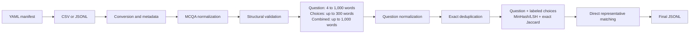

# Portuguese-MMLU

Data curation pipeline for Portuguese-MMLU, a multiple-choice question
answering (MCQA) benchmark built from Brazilian exams. The repository turns
tabular sources into a consistent JSONL dataset, applies structural and length
validation, and removes duplicate questions with NVIDIA NeMo Curator.

[Project website](https://golabai.github.io/mmlu-pt/) ·
[Paper](https://openreview.net/pdf?id=2FpqhqcNnu) ·
[Datasets](https://huggingface.co/collections/mmlu-pt/mmlu-pt-dataset)

> The current scope of this repository is data curation. The source CSV files
> and model evaluation code are not included in this repository.

## Pipeline



The pipeline performs the following operations:

1. Reads the sources declared in the manifest and adds `exam` and
   `academic_level` to each record.
2. Renames `statement` to `question`, converts `alternatives` into `choices`,
   and maps answers `A`–`E` to zero-based integer indices `0`–`4`.
3. Discards records with invalid or empty alternatives, mismatched choice and
   label counts, or anything other than four or five choices.
4. Keeps questions containing between 4 and 1,000 words, whose combined
   choices contain at most 300 words, and whose question plus choices contain
   at most 1,000 words. All limits are inclusive and applied in that order.
5. Normalizes question text with Unicode NFKC, `casefold`, and whitespace
   collapsing, then uses the result as the exact-deduplication key.
6. Applies fuzzy deduplication to normalized question plus ordered, labeled
   choices, then writes the final dataset with only the public fields.

Fuzzy deduplication uses character 8-grams, seed 42, 260 32-bit MinHashes,
10 bands of 26 hashes, at least one matching band, and exact Jaccard ≥ 0.94.
The answer is excluded from the similarity text. Representatives are processed
by descending number of filled public fields, descending normalized text length,
and ascending stable ID (SHA-256 of canonical public fields plus occurrence index).
An item is removed only when it directly matches an already preserved
representative in both LSH and Jaccard. Transitive connections alone cannot
cause removal. This is the parameter set selected by grouped-CV MCC in the
[parameter search notebook](notebooks/fuzzy_deduplication_parameter_search.ipynb).

Records that fail a filter are removed. At the end of a run, the pipeline
prints the input, output, and removal counts for every stage.

## Requirements

- Python 3.12 (`>=3.12,<3.13`);
- [uv](https://docs.astral.sh/uv/);
- an environment compatible with `nemo-curator[text_cuda12]==1.3.0`.

The lockfile includes the CUDA 12 variant of NeMo Curator and pins
`vllm==0.15.1` on Linux x86-64. This is therefore the project's primary target
environment.

Install the dependencies from the repository root:

```bash
uv sync
```

## Configuring sources

The [`config/sources.yaml`](config/sources.yaml) manifest is validated with
Pydantic. It must define a root directory, at least one source, and metadata for
every source:

```yaml
source_root: /path/to/source/files

sources:
  - path: enem/enem_questions.csv
    exam: ENEM
    academic_level: high_school

  - path: enade/enade_questions.jsonl
    exam: ENADE
    academic_level: undergraduate
```

Paths under `sources` are resolved relative to `source_root`. The only accepted
values for `academic_level` are `high_school` and `undergraduate`. CSV files
are read as UTF-8 with BOM support (`utf-8-sig`); both `.csv` and `.jsonl`
sources are supported.

The versioned manifest lists 19 sources, but its `source_root` is an absolute
path from the development environment. Update it before running the pipeline
on another machine.

### Input record contract

| Field | Expected format | Purpose |
| --- | --- | --- |
| `statement` | Text | Prompt that becomes `question` |
| `alternatives` | Dictionary or serialized Python literal | Must contain `text` and `label` lists |
| `answer` | An uppercase letter from `A` to `E` | Converted to a zero-based index |
| `exam_edition` | Text | Exam edition identifier |
| `exam_url` | Text | URL of the source exam |
| `num` | Text or integer | Question number in the source exam |

Example `alternatives` value in a CSV file:

```text
{'text': ['Choice A', 'Choice B', 'Choice C', 'Choice D'], 'label': ['A', 'B', 'C', 'D']}
```

Manifest values override existing `exam` and `academic_level` fields in a
source.

## Running the pipeline

Run the pipeline from the repository root:

```bash
uv run python -m mmlu_pt.pipeline_minimal \
  --config config/sources.yaml
```

`--manifest-file` is an alias for `--config`. Starting from step 1 recreates
`output/01 - original/` before preparing the sources, preventing stale files
from being mixed with the sources declared in the current manifest.

The output location is fixed to `output/`, relative to the working directory.
The exact-deduplication workspace is recreated whenever step 5 runs.
Fuzzy audits use a fingerprint of the input files and fixed parameters, with
separate run directories. GPU selection defaults to `CUDA_VISIBLE_DEVICES=0`;
an existing environment setting is respected.

Use `--resume-from-step` to reuse a materialized output and rerun that step and
the following ones:

```bash
uv run python -m mmlu_pt.pipeline_minimal --resume-from-step 5
```

| Starting step | Reused input | First operation executed |
| --- | --- | --- |
| `1` | None | Prepare the sources |
| `2` | `output/01 - original/` | Normalize the records |
| `3` | `output/02 - read/` | Apply structural filters |
| `4` | `output/03 - pre-word-filter/` | Apply the question, choice, and combined word-count filters |
| `5` | `output/04 - filtered/` | Run exact deduplication |
| `6` | `output/05 - deduplicated/` | Run fuzzy deduplication |

The selected input directory must contain at least one JSONL file for steps
2–5. Step 6 also accepts an empty directory as an empty dataset. The source
manifest is only used when starting from step 1. Starting from step 2 reuses
`output/01 - original/` without preparing or cleaning it. Outputs from the
selected step onward are recreated normally.

To rerun only fuzzy deduplication on GPU 0:

```bash
CUDA_VISIBLE_DEVICES=0 uv run python -m mmlu_pt.pipeline_minimal --resume-from-step 6
```

Step 6 runs after the earlier Ray context has closed. It computes MinHash in
batches of at most 2,048 items and records every removal and its preserved
representative, Jaccard, and number of matching bands. Empty or shorter-than-eight
normalized texts are preserved. The final JSONL is staged and validated before
publication; previous fuzzy outputs are retained in a `.fuzzy-backup-*` directory
whose path is printed after replacement.

## Outputs

```text
output/
├── 01 - original/                  # sources converted to JSONL
├── 02 - read/                      # normalized and auxiliary fields
├── 03 - pre-word-filter/           # after structural validation
├── 04 - filtered/                  # after all word-count filters
├── exact-deduplication-work/
│   ├── input/                      # materialized question_normalized field
│   └── results/
│       ├── ExactDuplicateIds/      # IDs identified as duplicates
│       └── exact_id_generator.json
├── 05 - deduplicated/              # exact-deduplicated dataset
├── fuzzy-deduplication-work/
│   └── <fingerprint>/run-*/         # manifest.json, records.jsonl, removals.jsonl
└── 06 - fuzzy-deduplicated/         # final dataset (data.jsonl)
```

NeMo Curator partitions intermediate data and may produce hash-based file names.
The final file `output/06 - fuzzy-deduplicated/data.jsonl` uses the following schema:

| Field | Description |
| --- | --- |
| `exam` | Exam name provided by the manifest |
| `exam_edition` | Exam edition |
| `exam_url` | URL of the source exam |
| `num` | Original question number |
| `question` | Question prompt |
| `choices` | List containing four or five choices |
| `answer` | Zero-based integer index of the correct answer |
| `academic_level` | `high_school` or `undergraduate` |

The intermediate directories make each transformation inspectable. They and
the final output directory are ignored by Git.

## Question-length analysis

The
[`notebooks/question_length_ablation.ipynb`](notebooks/question_length_ablation.ipynb)
notebook evaluates retention by exam and academic level across different
word-count thresholds. It reads `output/03 - pre-word-filter/` and selects
inclusive limits of 4 to 1,000 words for the question text.

```bash
uv sync --group notebook
uv run jupyter lab notebooks/question_length_ablation.ipynb
```

## Choice-length analysis

The
[`notebooks/choices_length_ablation.ipynb`](notebooks/choices_length_ablation.ipynb)
notebook evaluates maximum thresholds for the total number of words across all
choices. It reads `output/03 - pre-word-filter/`, reports the incremental effect
after the current question-length filter, and recommends an inclusive limit of
300 words.

```bash
uv sync --group notebook
uv run jupyter lab notebooks/choices_length_ablation.ipynb
```

## Question-plus-choices length analysis

The
[`notebooks/question_choices_length_ablation.ipynb`](notebooks/question_choices_length_ablation.ipynb)
notebook evaluates an additional maximum threshold on the combined word count
of each question and its choices. It applies the existing inclusive question
and choice limits first, then reports the incremental effect of candidate total
limits and selects an inclusive combined limit of 1,000 words.

```bash
uv sync --group notebook
uv run jupyter lab notebooks/question_choices_length_ablation.ipynb
```

## Semantic-deduplication exploration

The [semantic-deduplication notebook](notebooks/semantic_deduplication_ablation.ipynb)
compares BGE-M3, GTE-multilingual-base, Qwen3-Embedding-8B, and
NVIDIA Llama-Embed-Nemotron-8B on the 466 pairs in
`assets/annotations/manual_labels_llm_annotated.csv`. It contrasts question-only
and question-plus-choices embeddings, audits truncation, and selects a model and
cosine threshold using nested grouped cross-validation with MCC. Explanations
and literature references are in English; original exam questions remain in Portuguese.

```bash
uv sync --group notebook
CUDA_VISIBLE_DEVICES=0 uv run --group notebook jupyter lab notebooks/semantic_deduplication_ablation.ipynb
```

`RUN_COMPUTE=True` downloads the models and computes missing caches on one NVIDIA
GPU. Nemotron uses a temporary Transformers 4.51.0/tokenizers 0.21.4 runtime
through `notebooks/nemotron_embeddings.py`, preserving the project environment.
The full experiment targets a B200; batch sizes are configurable. Set
`RUN_COMPUTE=False` to reuse complete caches without initializing CUDA. Results,
model revisions, folds, figures, and manifests are saved under
`output/semantic-deduplication-ablation/`, keyed by the input and configuration.

The notebook also runs NeMo Curator 1.3.0 semantic deduplication with 1, 8, and 32
clusters on the annotated items. It distinguishes pair classification from item
removal, and audits references to items that are themselves marked for removal.
The labels and production corpus are never modified. Results describe a
lexically enriched, LLM-labeled sample rather than corpus-wide performance.

## LLM-as-a-Judge annotation

The annotation CLI classifies candidate question pairs as `duplicate`,
`related_but_distinct`, `distinct`, or `unsure`. It supports immediate,
row-by-row requests through the Responses API and asynchronous processing
through the Batch API. Install its dependencies and configure the API key:

```bash
uv sync --group annotation
export OPENAI_API_KEY="..."
```

Use synchronous mode for small tests or when results are needed immediately.
`--limit` selects the first eligible rows after already labeled rows are
discarded:

```bash
uv run --group annotation python scripts/llm_judge.py run \
  assets/annotations/manual_labels_blind.csv \
  --mode sync \
  --limit 10
```

Synchronous responses are persisted as they arrive. An interrupted execution
can continue from its checkpoint with the same arguments plus `--resume`.

Use Batch mode for larger offline runs:

```bash
uv run --group annotation python scripts/llm_judge.py run \
  assets/annotations/manual_labels_blind.csv \
  --mode batch
```

The Batch workflow can also be controlled step by step:

```bash
uv run --group annotation python scripts/llm_judge.py prepare \
  assets/annotations/manual_labels_blind.csv

uv run --group annotation python scripts/llm_judge.py submit \
  assets/annotations/manual_labels_blind.judge-requests.jsonl

uv run --group annotation python scripts/llm_judge.py status \
  assets/annotations/manual_labels_blind.batch-state.json

uv run --group annotation python scripts/llm_judge.py collect \
  assets/annotations/manual_labels_blind.csv
```

By default, the CLI writes the applicable files next to the input CSV:

```text
<stem>.judge-requests.jsonl
<stem>.judge-requests.meta.json
<stem>.batch-state.json
<stem>.sync-state.json
<stem>.responses.jsonl
<stem>.errors.jsonl
<stem>.judged.csv
```

Output paths, model, and reasoning effort can be changed through command-line
options. Existing labels are skipped unless `--include-labeled` is used. The
judge instructions live in
[`assets/prompts/question_pair_deduplication.md`](assets/prompts/question_pair_deduplication.md),
and their SHA-256 hash is recorded with each execution. The previous
`scripts/llm_judge_batch.py` entrypoint remains available for compatibility.

## Code structure

```text
src/mmlu_pt/
├── pipeline_minimal.py             # CLI arguments and orchestration
├── pipelines/
│   ├── definition.py               # NeMo Curator stages and workflows
│   └── fuzzy.py                    # MinHash, Jaccard, and direct representatives
├── mcqa_minimal.py                 # parsing, normalization, and predicates
├── llm_as_a_judge/
│   ├── judge_common.py             # shared request and result handling
│   ├── judge_sync.py               # synchronous Responses API transport
│   ├── judge_batch.py              # asynchronous Batch API transport
│   └── judge_cli.py                # command definitions and orchestration
└── utils/
    ├── csv.py                      # CSV/JSONL source preparation
    ├── manifest.py                 # manifest schema and loading
    └── pipeline_utils.py           # metrics and stage integration
```

## Current limitations

- Raw source files must be obtained separately.
- The `output/` directory cannot yet be configured through the command line.
- Exact deduplication still uses the question alone, so identical prompts with
  different choices can be removed before the fuzzy stage. Fuzzy deduplication
  is lexical; semantic deduplication is not implemented.
- Answers are validated as `A`–`E`, but their indices are not checked against
  the number of choices in each record.
- The repository does not yet include an automated test suite.

## License

The code is distributed under the [Apache License 2.0](LICENSE). Review the
terms of the original sources and published datasets before redistributing the
data.
